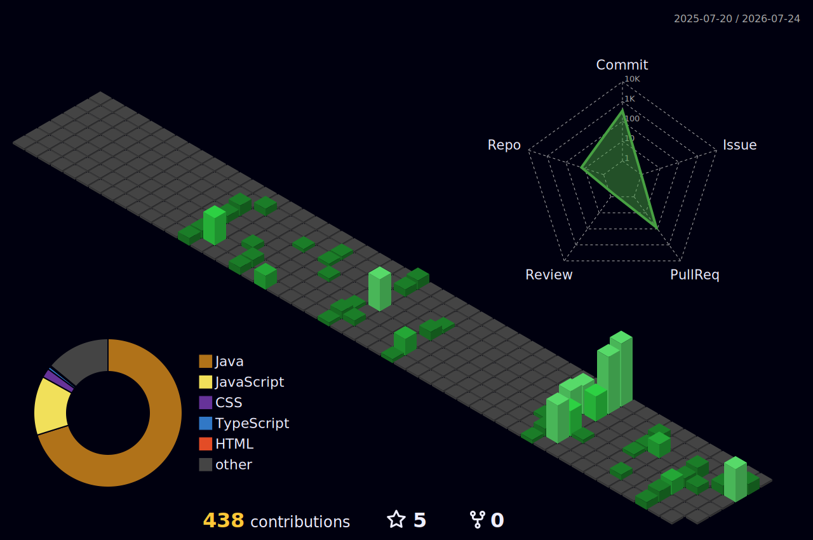

### `// whoami`
```
  name        → Érick Souza Bordin
  work        → Software Developer @ Syonet
  location    → Gravataí, Brazil
  languages   → Portuguese (Native) - English (Advanced)
```

---

### `// Software Developer @ Syonet`
```
  Java Software Developer (Intern) - Remote
  → High scalability and performance projects 
  → REST API integrations
  → Java, Quarkus, MongoDB, Postgre, REST APIs, Spring Boot, TypeScript
```

---

### `// tech stack`

<div align="center">

**Languages**


**Backend & Infra**


**Data**


**Automation & APIs**


</div>

---

### `// git stats`

<div align="center">



</div>

---

### `// featured projects`

<div align="center">
<table>
<tr>
<td width="50%">

**SeuCorre** &nbsp;`Mar 2026 – Present`

developing -- SaaS

`Java` `Spring Boot` `PostgreSQL` `Flyway` `RabbitMQ` `Claude API` `Garmin/Polar`

</td>
<td width="50%">

**🤖 Código Kid Assistant** &nbsp;`Sep 2025 – Present`

School automation solution in production. Chatbot for student management and class rescheduling, integrated with Google Sheets via Apps Script API. Eliminated manual daily searches within the school environment.

`JavaScript` `Google Apps Script` `Google Sheets API` `Regex`

</td>
</tr>
</table>
</div>
